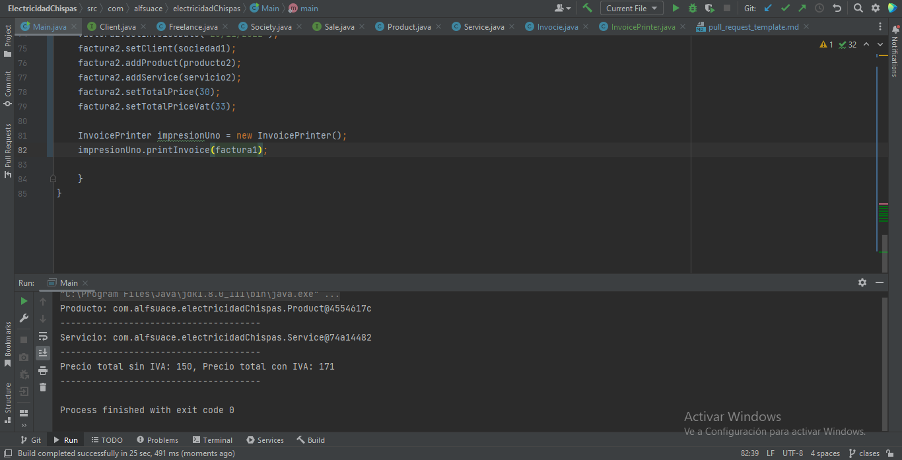

## Description de la tarea

<!-- Descripción sobre lo que se pide en la tarea -->
    Tarea realizada en funcion del enunciado

## ¿Cómo se ha implementado?

<!-- Estructura de clases, patrones: MVVM, etc.  -->
    Se han utilizado dos interfaces para dos clases cada una

## Keywords

<!-- Palabras relacionadas con los conceptos vistos -->
 Interfaz, implementacion, merge

## Screenshots or Video

<!-- Captura de pantalla de la consola -->

## Disclaimer
Intente hacer una lectura de la lista pero creo que no me ha salido del todo bien
## Objetivos

<!-- Lo actualiza el profesor.. 
Buscar en el README el Resultado de Aprendizaje con el que se está trabajando -->

## Criterios de Evaluación

<!-- 
    Lo actualiza el profesor.
    Buscar en el README los criterios de Evaluación con los que se están trabajando.
    Marca con una [X] los conseguidos. Ejemplo:
    [ ] Criterio Evaluación 1.
    [ ] Criterio Evaluación 2.
    [X] Criterio Evaluación 3.
-->